# English to 12-Year-Old AOLer Script 😜

A fun, nostalgia-driven JavaScript toy that takes ordinary text and converts it into something that looks like it was typed by a 12-year-old AOL user sometime around 1998.

Think AIM chats, random capitalization, excessive punctuation, and just a little bit of chaos.

---

<a id="why-this-exists"></a>
## Why This Exists

The early web was full of strange, joyful, low-stakes experiments. People wrote little scripts just because they could, shared them freely, and didn’t worry much about polish, frameworks, or long-term maintenance.

This project exists to **preserve that spirit**.

The original version of this script is a genuine artifact of that era. Version 2 keeps the output fun and chaotic, but modernizes the internals so the behavior is easier to understand, reason about, and extend—without losing the vibes.

It’s equal parts nostalgia and digital preservation.

---

<a id="version"></a>
## Version

**2.0.0** — Enhanced successor to the original script

The original version is preserved as a historical artifact; see [*Historical Script*](#historical-script-v1) below.

---

<a id="what-this-is"></a>
## What This Is

This project is intentionally playful. It exists to:

- Recreate the *feel* of early AOL / AIM writing
- Be fun to experiment with in a browser
- Preserve an old script while giving it a cleaner, more expressive successor

It is **not** meant to be linguistically accurate, culturally sensitive, or production-grade text processing. It’s a nostalgia toy.

---

<a id="how-it-works-high-level"></a>
## How It Works (High Level)

Version 2 introduces a small state machine that controls how certain acronyms (like `OMG`, `WTF`, and `LOL`) appear over time.

At a glance:

- Acronyms may repeat within a sentence (up to a limit)
- Repeated overuse eventually triggers a temporary clamp
- That clamp automatically relaxes after a fixed number of sentences
- Each acronym behaves independently

This creates output that feels chaotic but not completely unhinged.

---

<a id="state-machine-diagram"></a>
## State Machine Diagram

The following diagram shows the **per-acronym state machine** used by the enhanced version of the script.
Each acronym (`OMG`, `WTF`, `LOL`) runs this logic independently.



---

<a id="usage"></a>
## Usage

This script is designed to run **in a web browser**.

You will need:

- One text area for input
- One text area for output
- A button (or link) to trigger the translation

<a id="sample-html"></a>
### Sample HTML

```html
<form id="translate" name="translate">
  <p>
    <textarea
      style="width:100%"
      name="translatethis"
      rows="15"
      wrap="logical"></textarea>

    <input
      type="button"
      value="Translate!"
      onclick="document.translate.translated.value =
               translateAolSpeak2(document.translate.translatethis.value)">
  </p>

  <p>
    <textarea
      style="width:100%"
      name="translated"
      readonly
      rows="15"
      wrap="logical"></textarea>
  </p>
</form>
```

<a id="required-elements"></a>
### Required Elements

| Element | Required Name   | Purpose                      |
| ------- | --------------- | ---------------------------- |
| Input   | `translatethis` | Normal text input            |
| Output  | `translated`    | AOL-ified output             |
| Trigger | any             | Calls `translateAolSpeak2()` |

---

<a id="configuration-optional"></a>
## Configuration (Optional)

The enhanced version supports optional tuning if you want to experiment:

- **Intensity** – how aggressive the transformations feel
- **Grace window** – how many sentences can "go wild" before clamping
- **Cooldown depth** – how long clamping lasts once triggered

You do *not* need to configure anything to enjoy the default behavior.

---

<a id="roadmap-aka-possible-future-chaos"></a>
## Roadmap (a.k.a. Possible Future Chaos)

Things that *might* happen someday:

- Per-acronym personality weights
- Sentence-aware caps beyond two repeats
- Minimum sentence length gating
- Even more era-appropriate weirdness
- Expansion to include modern behavior found in TikTok/Instagram comments and texting + liberal overuse of emojis.

No promises. Chaos evolves.

---

<a id="historical-script-v1"></a>
## Historical Script (v1)

The original script (`aoler-translate.js`) predates this version and is preserved largely as-is:

- Written in an older JavaScript style
- Heavily index-based string manipulation
- Minimal structure, maximum vibes

It is included for historical interest and nostalgia only.
Version 2 exists to make the behavior easier to reason about and extend while keeping the spirit intact.

---

<a id="disclaimer"></a>
## Disclaimer

This project intentionally mimics early internet writing styles and slang from a specific era.

Some phrasing, tone, or stylistic choices may feel dated by modern standards. The script is presented for nostalgic and historical interest only, and is **not** an endorsement of any particular language, behavior, or stereotype.

---

<a id="authors"></a>
## Authors

* **Lucas Longley** (llongley@uvic.ca) — original script
* **BryanH** (bryan@master-developer.com) — formatting and minor cleanup for preservation of v1; v2 refactoring
    * ChatGPT 5.2 was involved in the development of this script. All AI-generated code was reviewed and tested by a human, then tweaked or edited as necessary. Feature definition is 100% human designed, so any feature shortcomings belong to the human author. Blame any buggy code on the LLM! Fight ✊ the power!

---

Have fun. Don’t take it too seriously. That’s the point.

<a id="cya"></a>
## CYA

This work is licensed under <a href="https://creativecommons.org/licenses/by/4.0/">CC BY 4.0</a>.

THE SOFTWARE IS PROVIDED "AS IS" AND, TO THE MAXIMUM EXTENT PERMITTED UNDER APPLICABLE LAW, THERE IS NO WARRANTY OF ANY KIND, EXPRESS OR IMPLIED, BY STATUTE OR OTHERWISE, INCLUDING BUT NOT LIMITED TO ANY IMPLIED WARRANTIES OF MERCHANTABILITY, FITNESS FOR A PARTICULAR PURPOSE, TITLE, OR NON-INFRINGMENT. THERE IS NO GUARANTEE THE SOFTWARE WILL FUNCTION UNINTERRUPTED, THAT IT WILL MEET REQUIREMENTS OF ANY KIND, THAT IT IS ERROR-FREE, OR THAT ANY ERRORS WILL BE CORRECTED.
